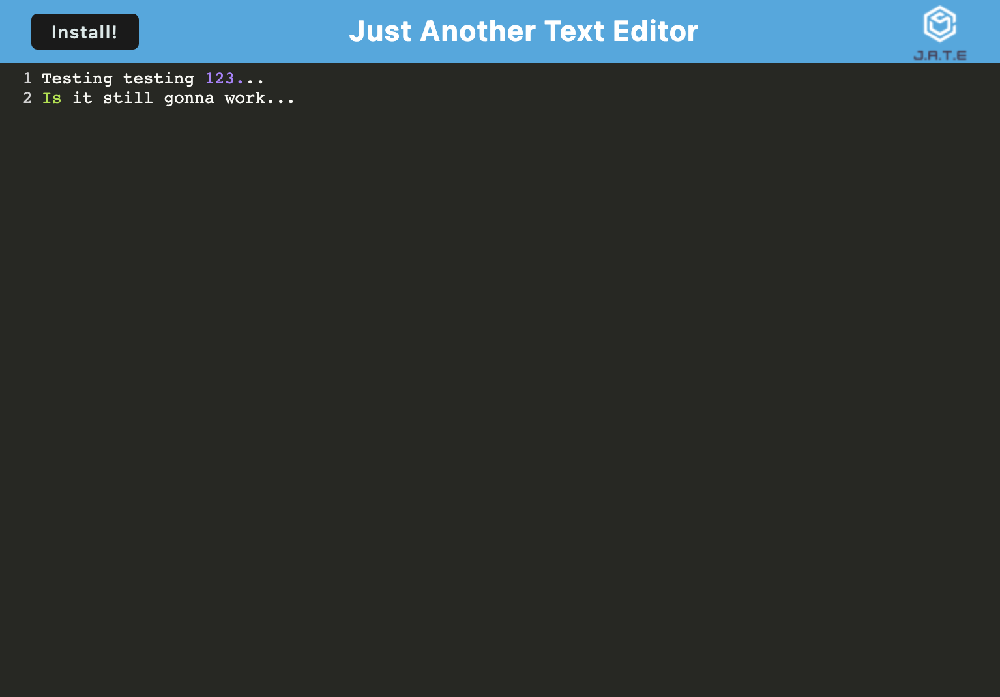

# JATE (Just Another Text Editor)

## Description
This app is a basic text editor that uses webpack. The user can easily install the app for offline use. Each session is saved to local storage when the window becomes unfocused. 

## Table of Contents
- [Installation](#installation)
- [Application Preview](#application-previous)
- [Credits](#credits)
- [MIT License](#mit-license)

## Installation
Navigate to the deployed application (link below) and click "Install" to install the application for offline usage. 
  
## Deployed Application

Above is what the app looks like before any data is stored. 

When data is stored, it will display automatically when coming back to the page based on the last save. 
[Click here to see the deployed application.](https://shrouded-journey-03662.herokuapp.com/)

## Credits
Had some minor issues retrieving the data and having it display on the page. I did have to get help by comparing my code to other code where people were retrieving data using indexedDB, and [this](https://dev.to/pandresdev/get-data-from-indexeddb-7hg) was one page that helped me understand what was missing. The main issue was using `result` instead of `result.value`, the former of which would return an error.

## MIT License
Distributed under the MIT License. Please follow [this link](https://opensource.org/licenses/MIT) for more information, or click on the badge at the top.
